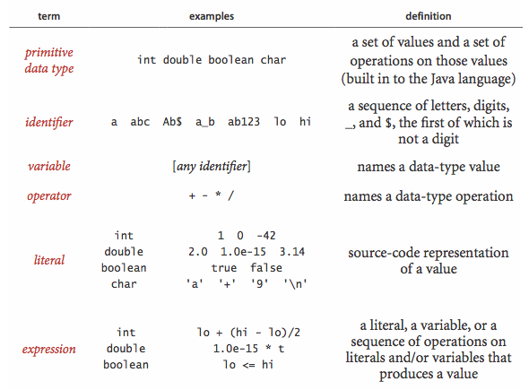
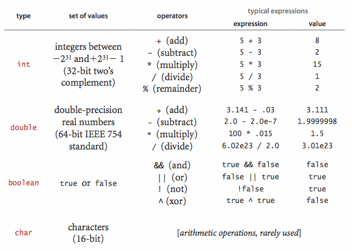
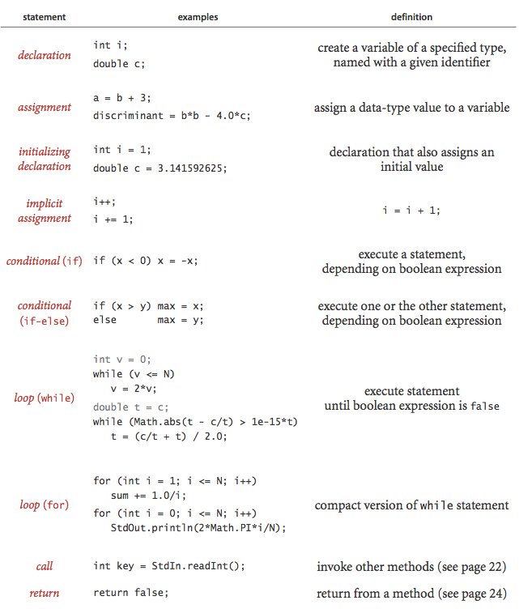
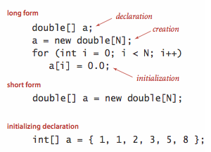
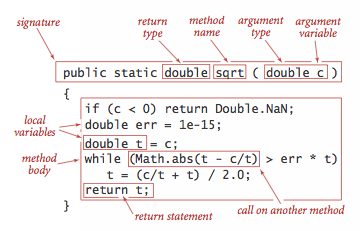

# Basics of Java Syntax

## Variables [(1)][1]

**A data type is a set of values and a set of operations on those values**

Java is a strongly typed language because the Java compiler checks for consistency. The scope of a variable is the part of the program where it is defined.

A Java program manipulates variables that are named with identifiers. Each variable is associated with a data type and stores one of the permissible data-type values. We use expressions to apply the operations associated with each type. [(2)][2]




```java
public class Variables {

   public static void main(String[] args) {
     // <variable_type> <varibale_name> = <value>
     // Naming convention - exampleName

     // numeric values, all signed
     byte   aByte     = 127; // 8 bits
     short  aShort    = 037654; // 16 bits
     int    anInteger = 123456; // 32 bits
     long   aLong     = 0xCAFE; // 64 bits

     // floating point numbers
     float aFloat     = 99.9F; // 32 bits, real number with single precision 
     double aDouble   = 98.0E+99;

     // unsigned number represents a character
     // coded using Unicode
     // use only '', "" is used for Strings
     char  aCharacter = 'A';      // behaves like 16 bits
           aCharacter = '\u0041'; // hexadecimal literal
           aCharacter = '\n';     // newline

    // logical value; true or false
    boolean aBoolean  = true;     // behaves like one bit
   }
}
```

## Operators

The following table summarizes the set of values and most common operations on those values for Java's `int`, `double`, `boolean`, and `char` data types. [(2)][2]



```java
public class Operators {
  
  public static void main(String[] args) {
    int i = 0;
    short aShort = 1;
    long aLong = 0xCAFEBABE;

    i++; // i = i + 1;
    i /= 2; i = i/2;

    aShort = (short) aLong;  // can 'cast' to force the assignment
  }
}
```

### Comparisons

- equal (`==`)
- not equal (`!=`)
- less than (`<`)
- less than or equal (`<=`)
- greater than (`>`)
- greater than or equal (`>=`)


## Statements

```java
public class Conditions {
  
  public static void main(String[] args) {
    int a = 100;
    int b = 199;

    if (a < b) {
      System.out.println(a + " is less than " + b);
    } else {
      System.out.println(a + " is greater than " + b);
    }

    switch (a) {
      case 98:
      case 99:
          System.out.println("a is 98 or 99");
          break;
      case 100:
          System.out.println("a is 100");
          break;
      default:
          System.out.println("a is something else");
          break;
    }

    int a = 0;
    while (a < 10) {
      System.out.println("a is " + a);
      a++;
    }

    do {
      System.out.println("a is " + a);
      a++;
    } while (a < 10);

    for (int x = 0; x < 10; x++) {  // x is scoped only inside the loop
      System.out.println("x is " + x);
    }

    for (  ; a < 20;  ) {  // equivalent to while (a < 20)
      System.out.println("a is " + a++);
    }

    for (;;) {
      System.out.println("a is " + a++);
      if (a > 25) {
        break;  // stop execution of the loop and continue the execution
      }
    }
  }
}
```

The following table illustrates different kinds of Java statements. [(2)][2]



## Arrays



Once we create an array, its size is fixed. A program can refer to the length of an array a[] with the code a.length. Java does automatic bounds checking—if you access an array with an illegal index your program will terminate with an `ArrayIndexOutOfBoundsException`.

```java
public class Arrays {
    
  public static void main(String[] args) {
    int[] values = { 1, 2, 3, 4, 5, 6, 13, 21, 34 };

    System.out.println("The fifth element of values is " + values[4]);

    System.out.println("There are " + values.length + " elements in values");

    for (int idx = 0; idx < values.length; idx++) {
      System.out.println("values[" + idx + "] is " + values[idx]);
    }

    int[] moreValues = new int[20];
    System.arraycopy(values, 0, moreValues, 0, values.length);

    int [][] raggedMatrix = {
        { 1, 2, 3 },
        { 4, 5 },
        { 6, 7, 8, 9 }
    };
    System.out.println("raggedMatrix[0][2] is " + raggedMatrix[0][2]);
  }
}
```

**Aliasing**. An array name refers to the whole array—if we assign one array name to another, then both refer to the same array, as illustrated in the following code fragment:
```java
int[] a = new int[N];
...
a[i] = 1234;
...
int[] b = a;
...
b[i] = 5678;   // a[i] is now 5678.
```

## Static Methods or Variables

With `static` you declare a class method or variable



```java
public class Methods {

  public static float average(float[] fa) {
      float sum = 0.0F;
      for (int idx = 0; idx < fa.length; idx++) {
          sum += fa[idx];
      }
      return sum / fa.length;
  } 
  
  // initial code
  public static void main(String[] args) {
      float[] fal = { 1.2F, 3.2F, 5.9F, 9.6F };

      float sum = 0.0F;
      for (int idx = 0; idx < fal.length; idx++) {
          sum += fal[idx];
      }
      float average = sum / fal.length;
      System.out.println("Average of the numbers is " + average);

      float[] fa2 = { 19.0F, 9.9F, 5.9F, 9.6F, 7.8F, 2.8F };

      sum = 0.0F;
      for (int idx = 0; idx < fa2.length; idx++) {
          sum += fa2[idx];
      }
      average = sum / fa2.length;
      System.out.println("Average of the numbers is " + average);


      // refactored code
      System.out.println("Average of the first set of numbers is " + average(fal));
      System.out.println("Average of the first set of numbers is " + average(fa2));

  }
}
```

## Data Structures

```java
/*
 *  Item.java
 */
package structures1;

public class Item {
    
    public String name;
    public int price;
    public int quantity;
}
```

```java
/*
 *  Structure1.java
 */
package structures1;

public class Structures1 {
    public static void main(String[] args) {
         Item an Item = new Item();
         anItem.name = "Frosty Crunches";
         anItem.price = 250;
         anItem.quantity 
    }
}
```

### Date Data Structure [(1)][1]

```java
/*
 *  Date.java
 */
package date1;

public class Date {
  public int day;
  public int month;
  public int year;

  public boolean isLeapYear(int year) {
      return (((year % 4) == 0) && ((year % 100) != 0)) || ((year % 400) == 0);
  }

  public int daysInMonth(int month, int year) {
    int rv;
    switch(month) {
        case 9: // Thirty days hath September
        case 4: // April
        case 6: // June
        case 11: // and November
            rv = 30;
            break;
        case 2:
            if (isLeapYear(year)) {
                rv = 29;
            } else {
                rv = 28;
            }
            break;
        default:
            rv = 31;
            break;
    }
    return rv;
  }

  public void nextDay() {
      int dayCount = daysInMonth(this.month, this.year);
      this.day++;
      if (this.day > dayCount) {
          this.day = 1;
          this.month++;
          if (this.month > 12) {
              this.month = 1;
              this.year++;
          }
      }
  }

  // Constructor
  public Date(int m, ind d, int, y) {
      this.day = d;
      this.month = m;
      this.year = y;
  }
}
```

```java
/*
 *  Date1.java
 */
package date1;

public class Date1 {
  
  public static void main(String[] args) {
      Date meetingDate = new Date(2, 29, 2012);

      System.out.println("Meeting will be on "
                + meetingDate.month + "/"
                + meetingDate.day + "/"
                + meetingDate.year);
  }
}
```

## References
- [Java Programming Basics by Simon Roberts][1]
- [Algorithms, 4th Edition by Robert Sedgewick and Kevin Wayne][2]

[1]: https://www.safaribooksonline.com/library/view/java-programming-basics/9780133975154/
[2]: http://algs4.cs.princeton.edu/home/