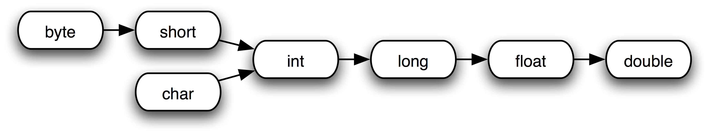

# Type Conversion in Java

```java
byte byteValue = 123;
short shortValue = byteValue;
int intValue = shortValue;
long longValue = intValue;

char charValue = '@';
int intFromChar = charValue;
long longFromChar = charValue;

float floatFromLong = longValue;
double doubleFromFloat = floatFromLong;
double doubleFromInt = intValue;
```

## Casting

```java
int intValue = 1024;
byte byteValue (byte) intValue; // 0

double pi = 3.14;
int intFromDouble = (int) pi; // 3

float largeFloat = 1e20f;
int intFromLargeFloat = (int) largeFloat; // 2*10^9

duble largeDouble = 1e100;
float floatFromLargeDouble = (float) largeDouble; // Infinity
```

## Automatic type conversion



```java
double doubleValue = 1d + 1f;

float floatValue = 1f * 1;

long longValue = 1L - '0';

byte a = 1;
byte b = 2;
byte c = (byte) (a + b); // int

byte a = 1;
a += 3; // a = (byte) (a + 3);

byte b = -1;
b >>>= 7; // b = (byte) (b >>> 7);
```

## Examples

```java
public char charExpession(int a) {
    return (char) ('\\' + a);
}
```